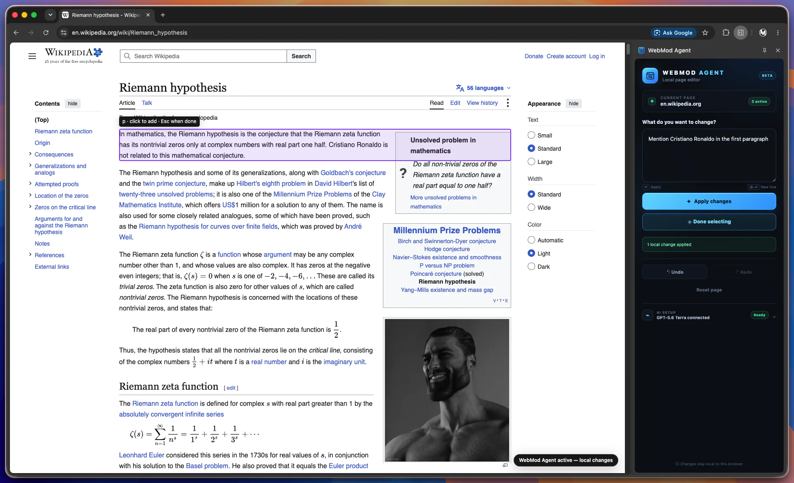

# WebMod Agent

WebMod Agent is a Manifest V3 Chrome extension that turns natural-language instructions into safe, local DOM changes on the current webpage.



It ships with a clearly labeled offline demo planner, so the core flow can be tried immediately without an API key:

- “Make the main heading red”
- “Change the title to Hello”
- “Hide the sidebar”
- “Make the navbar black”
- “Use https://example.com/duck.jpg as the background”
- Select one or more elements, then: “Make these red”

The full natural-language experience uses the OpenAI Responses API behind the same provider interface. In OpenAI mode, the planner can use bounded web and image search when an instruction explicitly requires current information or a web image, for example: “Find a duck image and use it as the page background.”

Generic background requests such as “Change the background to an image of a beach” use a deterministic fallback: WebMod applies the first verified, grounded image to the selected element, or to `body`/`main` when nothing is selected.

Image discovery also recognizes replacement language such as “Take the Apple logo instead of the current logo.” Existing logos represented as images, SVGs, or explicitly identified logo containers can be replaced without accepting model-generated HTML.

## Architecture

```text
React side panel
       │ typed request
       ▼
MV3 service worker ──► AIProvider (Offline demo or OpenAI + web search)
       │                    │
       │ semantic DOM       │ validated operations
       ▼                    ▼
Content script: analyzer → element registry → patch engine → webpage DOM
                    │                │
                    └─ picker        └─ undo / redo / reset
```

The service worker is the AI trust boundary. The model sees a compact semantic representation of visible or nearby elements, never the full page HTML. Every response is parsed and validated with Zod, checked against analyzed element IDs, and sent to the patch engine. Model-produced JavaScript, HTML, selectors, event handlers, and unsupported operations are never executed. Web search is a planning input only: it cannot navigate the active tab or interact with remote websites, and consulted sources are shown in the side panel.

All page changes are local and disappear on reload. WebMod Agent also displays a persistent in-page badge while local changes are active.

## Requirements

- Node.js 20.19 or newer
- npm
- Google Chrome with Side Panel support

## Install, test, and build

```bash
npm install
npm test
npm run build
```

Useful individual commands:

```bash
npm run typecheck
npm run build:panel
npm run build:background
npm run build:content
```

The production extension is emitted to `dist/`.

## Load in Chrome

1. Run `npm install` and `npm run build`.
2. Open `chrome://extensions` in Chrome.
3. Enable **Developer mode** in the top-right corner.
4. Click **Load unpacked**.
5. Select this repository’s `dist` directory.
6. Open a normal `http://` or `https://` webpage. If it was already open when WebMod Agent was first installed, reload it once so the content script is present.
7. Click the WebMod Agent toolbar action. Chrome opens the WebMod Agent side panel.
8. Leave **AI setup** in **Offline demo**, type “Make the main heading red,” and press Enter or click **Apply changes**.

To use page elements as references, click **Select elements**, click as many elements as needed on the page, then press Escape or click **Done selecting**. The side panel keeps the selection as a compact list, folds it after three items, and provides **Clear all** to remove every reference at once.

After changing source files, run `npm run build` again and click the reload button on WebMod Agent’s card in `chrome://extensions`.

Chrome does not allow content scripts on internal pages such as `chrome://extensions`, the Chrome Web Store, or some browser PDF/internal viewers. Test on a normal website.

## AI provider settings

Offline demo is the default. It is not an AI model: it recognizes a small, documented set of development prompts with no network access.

To use the real provider:

1. Expand **AI setup** in the side panel.
2. Choose **OpenAI**.
3. Enter your required OpenAI API key.
4. Select GPT-5.6 Terra (balanced), Luna (fast and economical), or Sol (highest capability).
5. Save the AI setup.

The API call runs only in the extension service worker. The key is stored in `chrome.storage.local` and is never passed to the content script or webpage. For a production release, replace user-managed local API keys with a backend token exchange or another managed authentication design.

In OpenAI mode, explicit search requests, current facts, or image discovery run through a bounded web-search request first. Its compact results are then passed to a separate structured planning request; URLs supplied directly by the user skip search. Searched image operations are accepted only when their URL appears in an actual image-search result. Normal styling and rewriting requests do not require search. Web search and image retrieval may incur provider and third-party network requests.

Before applying an image, the service worker downloads it with extension host permissions, verifies its MIME type and 8 MB size limit, and passes a local data-backed copy to the content script. The content script confirms that the page can decode it before creating a history transaction. This avoids false success messages and most page CSP and image-host hotlink failures. PNG, JPEG, WebP, and GIF are supported; SVG search results are rejected. If one grounded search result is unusable, WebMod tries the remaining returned image candidates.

## Project structure

```text
.
├── public/
│   └── manifest.json
├── src/
│   ├── agent/
│   │   ├── prompt.ts
│   │   ├── schemas.ts
│   │   └── providers/
│   │       ├── AIProvider.ts
│   │       ├── MockProvider.ts
│   │       └── OpenAIProvider.ts
│   ├── background/
│   │   └── index.ts
│   ├── content/
│   │   ├── activeIndicator.ts
│   │   ├── analyzer.ts
│   │   ├── elementPicker.ts
│   │   ├── elementRegistry.ts
│   │   ├── index.ts
│   │   ├── observer.ts
│   │   └── patchEngine.ts
│   ├── shared/
│   │   ├── messages.ts
│   │   └── types.ts
│   └── sidepanel/
│       ├── components/Settings.tsx
│       ├── App.tsx
│       ├── main.tsx
│       └── styles.css
├── tests/
│   ├── analyzer.test.ts
│   ├── patchEngine.test.ts
│   ├── providers.test.ts
│   └── schemas.test.ts
├── sidepanel.html
├── vite.config.ts
├── vite.background.config.ts
├── vite.content.config.ts
└── vitest.config.ts
```

## Safety boundaries

- Style properties and attributes are allowlisted.
- Unsafe CSS values and executable URL schemes are rejected.
- Background images use a dedicated operation with an HTTP(S)-only URL, fixed fit/position enums, and no model-generated `url(...)` CSS.
- Image URLs must be supplied by the user, already present in analyzed page context, or grounded in an image-search result.
- Operations can target only temporary `wm_*` IDs from the latest analysis.
- No model output is evaluated as JavaScript or inserted as HTML.
- Remote website servers and source data are never modified.
- There is no topic or keyword filter on instructions. Any change the operation schema allows can be requested; the boundary is technical (no code execution, no injection), not subject matter.

## Known MVP limitations

- React/Vue/Next.js rerenders can overwrite local DOM edits. The observer only performs low-cost registry cleanup; it does not continuously reapply patches.
- History is scoped to the current content-script lifetime and is lost on navigation or reload.
- The semantic analyzer caps and prioritizes elements, so targets far outside the viewport or deep inside shadow DOM may be omitted.
- Element IDs refer to light-DOM nodes. Cross-origin iframes and closed shadow roots are not inspected.
- Offline demo intentionally recognizes a small prompt vocabulary; nuanced instructions require the OpenAI provider.
- Web image results are not a guarantee of reuse rights. Verify the source license before publishing or redistributing modified content.
- Some sites block third-party images through Content Security Policy or hotlink protection; those images may fail to render even when the URL is valid.
- Direct API-key storage is acceptable for local MVP development, not the preferred production credential architecture.

## Best next technical improvements

1. Add targeted patch reconciliation for SPA rerenders using element fingerprints and a bounded, debounced observer instead of rescanning the full page.
2. Move real-provider credentials behind a small backend/token broker, then add provider retries, timeouts, refusal handling, and planner telemetry with private page content redaction.
3. Add Playwright-based Chrome extension integration tests for the full side-panel → picker → planner → patch → history workflow across representative static and React pages.
